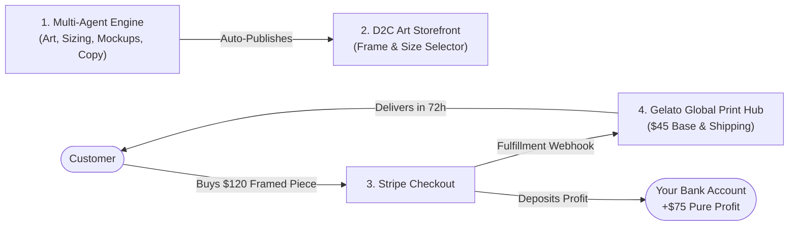

# 🎨 Atelier & Canvas: Autonomous Wall Art Multi-Agent E-Commerce System

An end-to-end multi-agent system that automates the entire wall art business: discovers trending interior aesthetics, generates print-ready fine art, maps supplier SKUs & profit margins (Gelato POD), composites photorealistic room mockups, and publishes directly to a **live, mobile-ready D2C Web Storefront with Stripe Checkout and automated 72-hour Gelato fulfillment**.

---

## ⚡ Revenue & Business Mechanics



### Unit Economics per Sale (24x36" Solid Natural Oak Frame)
* **Retail Price to Customer**: **\$120.00**
* **Gelato Base Manufacturing Cost**: \$36.50
* **Domestic Tracked Shipping**: \$9.40
* **Stripe Payment Gateway Fee (2.9% + \$0.30)**: \$3.78
* **Net Landed Cost**: \$49.68
* **💰 Pure Net Profit**: **\$70.32 (58.6% Margin)**

---

## 🤖 The Multi-Agent Team

1. **Trend & Interior Scout Agent** (`agents/trend_scout_agent.py`): Curates trending interior styles (Japandi, Bauhaus, Botanical, Mediterranean, Dark Academia) and formulates fine art briefs.
2. **Art Generation Agent** (`agents/art_generator_agent.py`): Creates 300 DPI master artwork configured for standard gallery aspect ratios (2:3, 3:4, 4:5).
3. **Supplier Sourcing & Margin Agent** (`agents/supplier_sourcing_agent.py`): Maps dimensions and frames (Natural Oak, Black Wood, White Wood, Stretched Canvas, Unframed) to real Gelato SKUs and guarantees $\ge 50\%$ net margins.
4. **Room Mockup Agent** (`agents/mockup_agent.py`): Composites artwork into 4 realistic interior scenes (Living Room, Master Bedroom, Nordic Studio, and Framed Close-up).
5. **Listing & SEO Agent** (`agents/listing_seo_agent.py`): Generates search-optimized titles, Etsy/Shopify keyword tags, dimension charts, and interior styling copy.
6. **Storefront & Sync Agent** (`agents/storefront_sync_agent.py`): Automatically deploys products to the live web catalog and exports Shopify/Etsy CSVs.

---

## 🚀 Quick Start Guide

### 1. Install Dependencies
```bash
cd C:\Users\pedro\.gemini\antigravity\scratch\art_ecommerce_agents
pip install -r requirements.txt
```

### 2. Configure Environment (Optional)
Copy `.env.example` to `.env` and add your API keys:
```bash
cp .env.example .env
```
*(Note: The system includes a full Mock Provider and Procedural Art Generator, so it works out of the box even without API keys!)*

### 3. Generate Fine Art Collections
Generate a single collection with agents:
```bash
python main.py --generate --theme japandi-minimalism
```

Or populate your entire store with all 5 aesthetic collections:
```bash
python main.py --generate-all
```

### 4. Launch Your Live D2C Web Storefront
```bash
python main.py --serve
```
Open your browser at **[http://localhost:8000](http://localhost:8000)** to browse your gallery, test the interactive frame/size selector, and try express checkout!

---

## 📁 Project Structure

```
art_ecommerce_agents/
├── config/
│   ├── settings.py                 # Margin thresholds, API keys, paths
│   └── styles_catalog.json         # Seed aesthetics (Japandi, Bauhaus, etc.)
├── agents/                         # The 6 autonomous agents
├── suppliers/
│   ├── gelato_client.py            # Gelato API client + 32-country routing
│   └── pricing_models.py           # SKUs, frame types, size definitions
├── storefront/                     # The Live D2C Web Storefront
│   ├── app.py                      # FastAPI server with Stripe & Gelato webhooks
│   ├── static/                     # CSS & client-side configurator JavaScript
│   ├── templates/                  # Base layout, Home gallery, Product page, Success
│   └── catalog.json                # Live synchronized product catalog
├── pipeline/
│   └── orchestrator.py             # Master multi-agent orchestrator
├── output/                         # Print-ready art, room mockups & CSV exports
├── main.py                         # Unified CLI entrypoint
└── README.md
```
